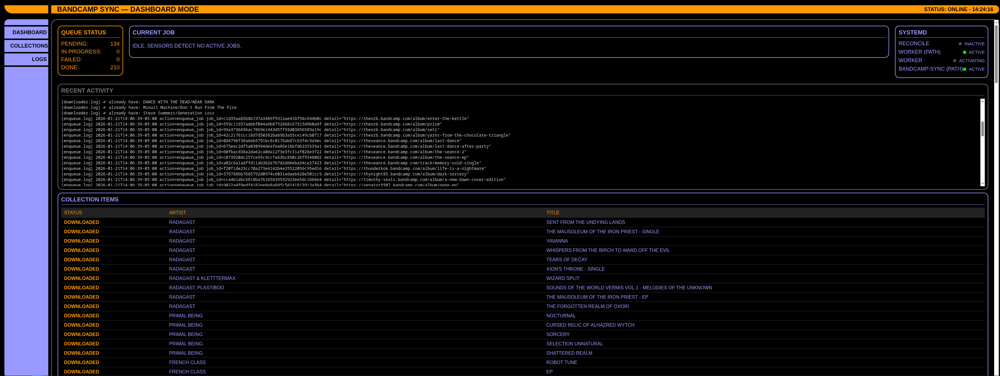
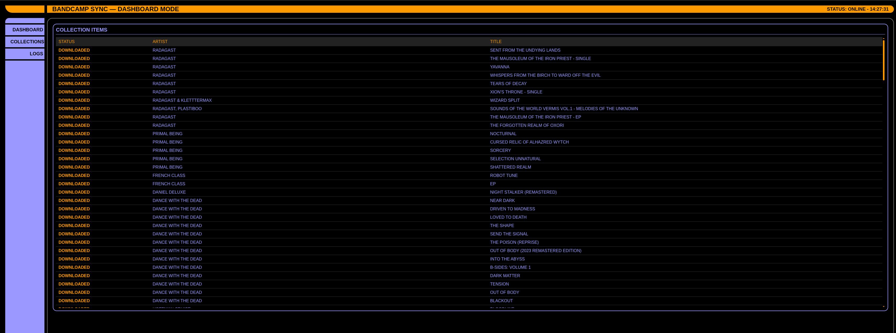

# BandcampSync

BandcampSync is a file-backed, stage-driven pipeline for syncing Bandcamp albums.
Helpers live in `bin/` and only observe/trigger stages.

## Setup

1. **Install Dependencies**:

   ```bash
   # Create virtual environment
   python3 -m venv venv
   source venv/bin/activate
   pip install -r requirements.txt # flask, requests, playwright, yt-dlp
   playwright install chromium
   ```

2. **Add Cookies**:
   - Save your Netscape-formatted Bandcamp cookies to `~/.config/bandcamp/cookies.txt`.
   - You can use an extension like "Get cookies.txt LOCALLY".

3. **Discover Fan ID**:

   ```bash
   # Navigates to your profile to find your ID
   python3 bin/capture_fan_id.py
   ```

4. **Install Systemd Services**:

   ```bash
   cp systemd/*.service ~/.config/systemd/user/
   systemctl --user daemon-reload
   systemctl --user enable --now bandcamp-dashboard bandcamp-sync-worker
   ```

## Usage

### Web Dashboard

Open `http://localhost:5000` to view:

- System status (Queue counts, Worker activity)
- Complete Collection List (with sync status)
- Real-time logs

### Synchronization Loop

1. **Refresh Library**:
   Scrapes your latest collection items to `collection.json`.

   ```bash
   venv/bin/python capture_collection_api.py
   ```

2. **Reconcile & Download**:
   Parses `collection.json`, finds new items, and queues them.

   ```bash
   python3 extract_owned.py && Sync/bin/enqueue_owned.sh
   ```

   *The background worker (`bandcamp-sync-worker`) handles the actual downloading.*

## File Locations

- **Downloaded Music**: `~/Music/Bandcamp/<Artist>/<Album>/`
- **Configuration**: `~/BandcampSync/config/`
- **Logs**: `~/BandcampSync/Sync/logs/`
- **Queue State**: `~/BandcampSync/Sync/inbox/`

## Troubleshooting

### Manual Fan ID Extraction

If `capture_fan_id.py` fails:

1. Open Bandcamp in your browser.
2. Go to your profile page.
3. Open Developer Console (F12).
4. Type `window.FanData.fan_id`.
5. Save the number to `~/BandcampSync/config/fan_id.txt`.

### Scraper Issues

If the scraper stops early:

- Check `debug.html` to see what the scraper saw.
- Ensure your internet connection is stable.
- Run manually with `venv/bin/python capture_collection_api.py` to watch stdout.

## Features

<!--
Source - https://stackoverflow.com/a
Posted by Philipp Schwarz, modified by community. See post 'Timeline' for change history
Retrieved 2026-01-22, License - CC BY-SA 4.0
-->
The dashboard will be available at [http://localhost:5000](http://localhost:5000).

### The LCARS-style dashboard provides a high-contrast overview of system status.


### The collections view shows all albums in your Bandcamp collection, with sync status indicators.


### The logs view shows real-time logs from the sync worker.


## API Endpoints

- `GET /api/status`: Systemd unit states.
- `GET /api/queue`: Counts of jobs in inbox directories.
- `GET /api/logs`: Tailed content of log files.
